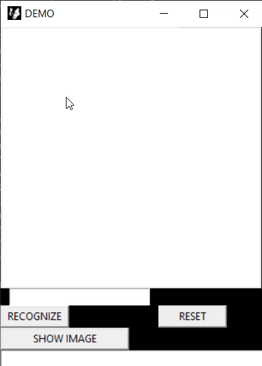

# Interactive-MNIST-app
This is an interactive MNIST app where user can draw a digit and the program will make a prediction using a CNN trained on MNIST.

Requirements are:
numpy,
matplotlib,
scipy, 
opencv,
tensorflow

To run the app just run GUI.py.

## Features

Currently the app is able to make a prediction, show what the input looks like and show top 3 predictions. 

Note: The goal of this app is not design so there has not been much attention to that.

## DEMO 

